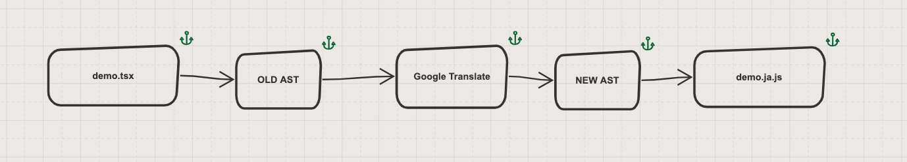

# react-ast-translate

React Intl Simple DEMO

## Usage

```
$ git clone https://github.com/Nelayah/react-ast-translate.git
$ cd project
$ npm install
$ FROM=zh-CN TO=ja node ./src/index.js
```

## Translate

`example/demo.tsx`

```jsx
import * as React from 'react';

interface IAppProps {}

const Component: React.FC<IAppProps> = () => {
  return (
    <div className="container">
      Depth-First-Search
      <span>深度优先遍历（Depth-First-Search），是搜索算法的一种，它沿着树的深度遍历树的节点，尽可能深地搜索树的分支。</span>
      <span>当节点v的所有边都已被探寻过，将回溯到发现节点v的那条边的起始节点。</span>
      <span>这一过程一直进行到已探寻源节点到其他所有节点为止，如果还有未被发现的节点，则选择其中一个未被发现的节点为源节点并重复以上操作，直到所有节点都被探寻完成。</span>
    </div>
  );
};
Component.displayName = 'Demo';

export default Component;
```


`output/demo.ja.js`

```javascript
import * as React from 'react';


const Component = () => {
  return /*#__PURE__*/(
    React.createElement("div", { className: "container" }, "深さ優先-検索", /*#__PURE__*/

    React.createElement("span", null, "深さ優先探索（深さ優先-検索）、その木に沿ってツリーノードの深さ、限り探索木の枝を横断、検索アルゴリズムです。"), /*#__PURE__*/
    React.createElement("span", null, "すべてのエッジは、発信ノード発見エッジノードvにピースバック超えるノードvを模索してきたとき。"), /*#__PURE__*/
    React.createElement("span", null, "このプロセスは、未検出のノードがある場合、すべてのノードが完了探索されるまで、ノードは、ソースノードと未知の繰り返しとして選択されたソースノードが、現在までのすべての他のノードが発見されるまで継続します。")));


};
Component.displayName = 'Demo';

export default Component;
```

## Simple



